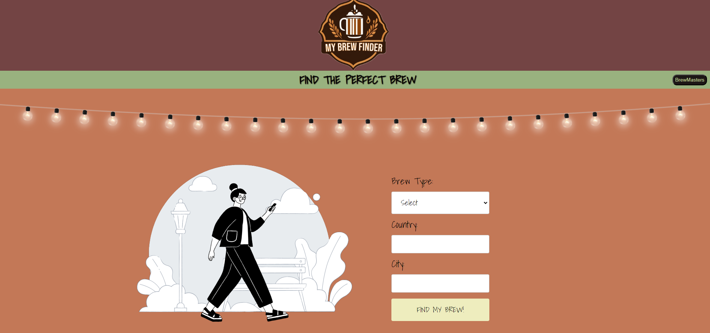

# My-Brew-Finder

## Description
"My Brew Finder" is a web app for travelers, passionate about local beverages. Using the Wikipedia API, it provides information about the destination, including population, a general description, and location. Leveraging the Yelp Fusion API, the app identifies and reviews coffee shops (or breweries) in the user provided city. This dual functionality helps travelers plan visits to local coffee shops and breweries, ensuring a rich tasting experience.

## Table of Contents 

- [Installation](#installation)
- [Usage](#usage)
- [How-To-Guide](#how-to-guide)
- [Credits](#credits)
- [License](#license)

## Installation

To clone the application, click the green button labeled, "code." Copy the URL for the repository, using HTTPS, SSH, or GitHub CLI. Open Git Bash. Change the working directory to the desired location for the cloned directory. Type "git clone" and paste the copied URL. Press "enter" to create your local clone.

## Usage

Beginning on "form.html," the user will see the "My Brew Finder" logo in the header and a form to collect user input. After completing the form and upon clicking the "FIND MY BREW!" button, the user is directed to "info.html." The user will see the heading, "THE PERFECT BREW, FOUND FOR YOU!" and is presented with search results from Wikipedia and Yelp. There is a modal which provides information about the creators. The user can click the "go back" button to return to the home page.

## How-To-Guide
<ul>    
    <li>GIVEN the MyBrewFinder</li>
    <li>WHEN I load the app</li>
    <li>THEN I am presented with the landing page containing a "BrewMasters" button and form with inputs for brew type, country, and city</li>
    <li>WHEN I click the BrewMasters button</li>
    <li>THEN I am presented with a link to each of the creators email address, "Bucket List Brew Location," GitHub profile, and preferred brew</li>
    <li>WHEN I enter try to submit a form without a city, country, or brew type</li>
    <li>THEN I am presented with a message that prompts me to "Please complete all inputs!"</li>
    <li>WHEN I submit the form</li>
    <li>THEN the user input is stored in local storage</li>
    <li>WHEN the form submits</li>
    <li>THEN I am redirected to the results page</li>
    <li>WHEN I view the results page</li>
    <li>THEN I am presented with a header, a form, and a "Go back" button</li>
    <li>WHEN I click the "Go back" button</li>
    <li>THEN I am redirected to the landing page</li>
    <li>WHEN I view the content on the results page</li>
    <li>THEN the user input in local storage is looped through the Wikipedia API</li>
    <li>THEN I am presented with "Fun Facts!"</li>
    <li>WHEN I view the content on the results page</li>
    <li>THEN the user input in local storage is looped through the Yelp API</li>
    <li>THEN I am presented with three cards, containing the name, location, rating, and an image for each of the top three search results</li>
    
</ul>

## Credits
<ul>
    <li>Tutoring session with Juan Delgado</li>
    <li>Tutoring session with Alexis San Javier</li>
    <li>Office hours with Anthony Barragan</li>
    <li>In collaboration with Jordan Gonzales, Justin Herrera, Renz Supnet, and Heather Weltzien</li>
    
</ul>

## License
 
Please refer to the LICENSE in the repo.

# [link to completed project](________________)